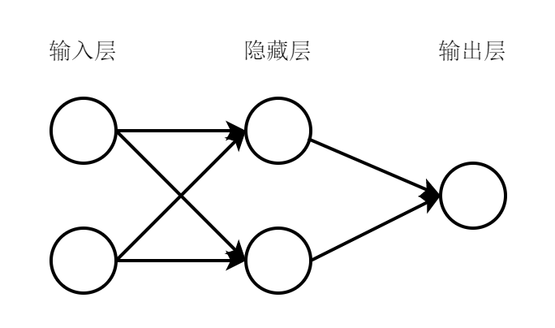
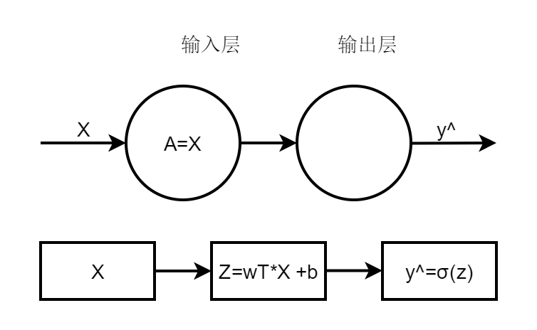
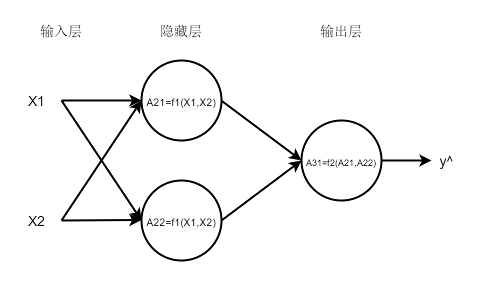

# Simple Double Layer BP

## 简单的双层神经网络原理

关于BP神经网络的[基本知识](https://zhuanlan.zhihu.com/p/52046778)可以参考其他博主的分享，这里不再重复了。

笔者希望从实践的角度认识多层神经网络的结构。首先创建一个简单的双层神经网络，观察双层神经网络的预测结果与单个神经元《logistics regression》结果对比，观察是否有识别率的提升？

因此笔者实际构建的网络形状如下图

实践的数据集用例依旧和上一章《logistics regression》的数据集一致，是100个带有 0 或 1 标签的二维点集合(X1,X2)。样本是(X1,X2,label)这样的结构。目标是使用双层神经网络建立模型，当出现新的点的时候预测其结果是0还是1。检验模型的方法是将100个数据留下20个作为测试集，剩下80个作为训练集。当模型训练完毕，使用测试集输入对应(x1,x2)，得到预测的值与实际值进行比较。（方法与《logistics regression》一致）。

## 正向传播过程

先回顾单个神经元正向传播的过程

输入X数据，X包含每个点的坐标信息(X1,X2),是一个二维的向量，多个点坐标堆叠起来得到一个数据输入矩阵X，经过w的线性变化之后得到Z,Z通过激活函数得到最终的预测值$\hat{y}$，这个模型按照神经网络的术语来看，是没有隐藏层的。

这个是逻辑回归问题正向传播的过程，反向误差传递以及梯度下降法只是为了确认最佳的w与b的参数取值。反向误差传播最核心的思想在于通过变化模型参数，使得损失函数越来越小，梯度下降法指明了w使得损失函数变小的最佳方向。

个人认为复杂的神经网络也就是单个神经元（逻辑回归模型）算法的堆砌。

本篇文章按照吴恩达教授在线教程的约定符号叙述
上标代表神经网络层数，下标代表第几个神经元。
例如
$$A^{[1]}_1$$代表第一层网络的第一个神经元线性激活后的输出。

则
$$A^{[1]}_1 = \sigma({w_1^{[1]T}} * X + b^{[1]})$$

$$A^{[1]}_2 = \sigma(w_2^{[1]T} * X + b^{[1]})$$

$$\hat{y} = A^{[2]}_1 = \sigma(w_1^{[2]T} * A + b^{[2]})$$

因为本例子还是试图解决二分类问题，所以激活函数还是选择sigma。

**总结公式(第m层的第n个神经元输出为)**

$$\hat{y} = A^{[m]}_n = \sigma(w_n^{[m]T} * A^{[m-1]} + b^{[m]})$$

$$A^{[0]} = X$$
第0层也就是输入层就是原始数据X。
  

## 与逻辑回归问题的对比思考

逻辑回归的问题，没有隐藏层，原始数据X只需做一次wx+b的线性变化，经过以此激活后就得到的预测输出。神经网络的模型多了一层隐藏层，输出层的时候将隐藏层wx+b线性变化再进行了一次wx+b变化。也就是相当于把隐藏层的输出当作单个神经元的输入，对进行过一次神经元变化的输出重新作为输入进入到神经元中。

其实没有根本上的原理提升，只是增加了神经元的个数。因此梯度下降法，反向误差传递之类的思想依旧适用，没有显然的变化。只是需要训练的参数增加了两倍。

思考到我这里设计的网络，隐藏层有两个神经元，如果初始的$w_1^{[1]}$与$w_2^{[1]}$完全相等的话，那两个隐藏神经元做的操作就是完全一致的，这样似乎和一个神经元效果一样，所以需要随机初始值，这样可以保证两个神经元的计算不相同。

## 损失函数

因为依旧是二分类问题，因此确定损失函数与逻辑回归一致

$$J(y,\hat{y})=-(yln(\hat{y})+(1-y)ln(1-\hat{y}))$$

根据梯度下降法，需要指导w的变化方向使得损失函数减小。

$$\frac{\partial J}{\partial {w_1^{[1]}}} = \frac{\partial J}{\partial A} \frac{\partial A}{\partial z} \frac {\partial L(a,y)}{\partial a}$$