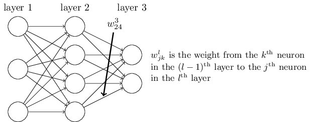
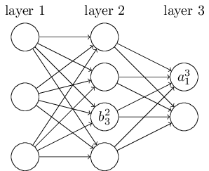
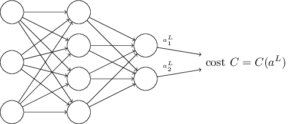
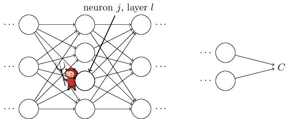
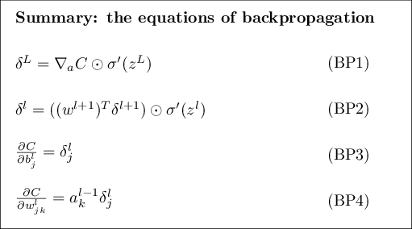

# 嵌入式AI -- 神经网络反向传播算法是如何工作的？

## 前言

上一篇文章，笔者介绍了单个神经元的训练方法，笔者下一步的计划是构建更加复杂的神经网络结构，然后用相同的数据集来评判下复杂的神经网络结构是否会比单个神经元训练的准确度更高。

复杂神经网络的向前传播不难，在我面前的拦路虎是反向传播算法，有一部分人认为不需要掌握其中的数学原理，这个想法针对于我的理想不适用，因为我想把这个算法使用在嵌入式平台，所以我不希望在我面前有任何黑箱子。因此数学原理我也一定要完全理解。

笔者理论知识也就是本科理工生水平，但最近有恶补《概率》与《高等数学》。概率的话我推荐听一听台大的[《机率》](https://www.bilibili.com/video/BV19W411n72c?from=search&seid=4060410517245332628&spm_id_from=333.337.0.0),老师讲课蛮有意思的，非常幽默，上他的课很棒。

如果错误的地方，请各位多多指正。

# 基于矩阵的快速神经网络计算方法---正向传播

首先，我们约定若干个符号

${W^l}_{jk}$  : 代表$l-1$层的第$k$个神经元到$l$层第$j$个神经元的权重系数。

例如，上图${W^3}_{24}$代表着第二层的第四个神经元到第三层的第二个神经元的权重系数。

最开始看这个式子会显得陌生，但是多看看就熟悉了，这个符号的一个特点是j和k的顺序，记住k是输入，j是输出。文章后面会继续谈到使用这个顺序的原因。

我们接下来使用类似的符号来表示网络的偏置参数以及激活函数输出。

$b^l_j$  : 代表第l层第j个神经元的偏置系数。
$a^l_j$  : 代表第l层第j个神经元经过激活函数后的输出。

例如，上图$b^2_3$代表第二层第三个神经元的偏置系数，$a^3_1$代表第三层第一个神经元经过激活函数的输出。

完成这些定义后，我们给出每一层神经元输出的总体公式

$$a^l_j = \sigma(\sum_k{{w_{jk}}^l{a_k}^{l-1}+{b_j}^l})$$

这里的求和指的是l层第k个神经元的输出是所有l-1层的神经元在经过对应${W^l}_{jk}$与$b^l_j$变换之后求和，完成求和之后再经过一次激活函数得到最终的输出。k是遍历所有l-1层神经元的的遍历参数。

为了去简化这个公式，我们使用矩阵的写法

把所有$w^l_0$$w^l_1$$w^l_2$$w^l_3$..堆叠成为大矩阵$w^l$，$w^l$包含了l层的所有权重参数信息。这个矩阵的第j行，第k列就是${w^l}_{jk}$。
类似的我们可以堆叠出 $b^l$以及$a^l$。

这些矩阵都是通过将相同信息的元素合并同类项，从而堆叠矩阵的而来的。

由上述堆叠出来的新矩阵符号，$w^l$ $b^l$ $a^l$

我们可以得到一个最简化的形式

$$a^l = \sigma(w^la^{l-1}+b^l_j)$$

这个表达式给了我们一个整体的对神经网络的认识，新的一层的神经元输出是如何由上一层神经元计算而来：首先对上一层神经元的激活输出进行一次$w^l$的权重变化，然后再加上偏置$b^l_j$，最后再经过激活函数即可得到第此层的神经网络输出。这种用矩阵来抽象的全局思想可以减少程序中的for循环。特别的，在嵌入式开发中，有些芯片支持SIMD指令，可以加速矩阵的运算速度。如果用矩阵思想来构建代码，远比用for循环快得多。

# 损失函数需要做出的两个假定

反向传播(backpropagation)的目标是计算成本函数C对$w$ $b$的偏导数。其中$w$和$b$包含了任意层，任意神经元的所有权重偏置信息。换言之，目标是确定整个网络中成本函数对所有权重或偏置参数的偏导数。

想要反向传播工作，我们需要对损失函数的形式做出两个重要的假设。在说明这些假设之前，我们需要首先在心中有一个损失函数的例子。

我们将会使用“quadratic cost function”来作为这个例子。

$$C(w,b)=\frac{1}{2n}\sum_x{{||y(x)-a^L(x)||}^2}$$

其中 n是样本的总数，求和会将所有样本的损失累加。y(x)是样本的期望输出
L指明了层数，$a^L(x)$是神经网络的预测输出。

这个公式显然的定义了损失函数，因为我们希望我们的模型预测的结果$a^L(x)$与样本的真实结果$y(x)$尽可能的相等，从公式上来看，这两个变量越相等，总体损失就越小，模型描述的就越准确，是符合直觉的。

有了上述的例子，我们要开始说明想要反向传播算法工作需要做出哪些假设。

**第一个假设是：损失函数可以被写成每一个样本的损失结果求和取平均的形式**

$$C_{Average}=\frac{1}{n}\sum_x{C_x}$$

$$C_x = \frac{1}{2}||y-a^L||$$

显然的看出，上面提的"quadratic cost function"函数是满足这个假设要求的。
也就是总的损失函数，可以写成每一个样本的损失平均值。

需要做出这样的假设的原因在于，反向传播真正让我们做的事情是计算单个样本的损失函数$C_x$对w与b的偏导，我们通过对所有单个样本的损失偏导取均值来计算$C$对w与b偏导的取值。

当我们做出这样的假设，整体数据集的损失计算方法与单个样本的损失计算方法是很方便转化的，只要对所有单个样本的损失取平均就可以得到整个数据集的损失。因此，我们干脆简化问题，后面都以单个样本来讨论和推理问题。将$C_x$化简为$C$。

**我们对损失函数将做出的第二个假设是：损失函数可以写成神经网络的输出函数**

举个例子，"quadratic cost function"，函数满足这样的假设。

单个样本通过"quadratic cost function"计算损失的公式如下

$$C = \frac{1}{2}{||y-a^L||}^2 = \frac{1}{2}\sum_j{(y-a^L_j)}^2 $$

笔者的理解是需要保证损失函数是关于待确定的参数的函数，如上面的公式，损失函数由两个变量决定，分别是y以及$a^L_j$, y 是样本的真实输出，可以理解为是固定不变的常量，$a^L_j$是关于w,b,x三个元素的函数，其中x也是固定的输入，看作一个常量。因此损失函数就可以看作是仅关于待确定参数w,b两个变量的函数。

**笔者的理解是：“损失函数一定要和待确定的参数w,b相关”**。

这也许是一句废话，因为前人提供的经典损失函数一定考虑到了这一点。重点在于理解单个样本输入的条件下损失函数是关于w与b这样的待训练参数的函数。

# 定义一个线性代数中不常见的操作 $s \bigodot t$

$s \bigodot t$ 对应每个位置的元素相乘。

例如 
$$[1,2] \bigodot [3,4] = [3,8]$$

# 反向传播算法之前的四个公式推导

反向传播算法是讨论权重参数与偏置的变化是如何影响损失函数的问题，总体来说就是计算任意l-1层的第j神经元个神经元到l层第k个神经元的权重$w^l_{jk}$,$b^l_j$对于损失函数C的偏导数。

在计算偏导数$$\frac{\partial{C}}{w^l_{jk}} 与 \frac{\partial{C}}{b^l_j}$$
之前，我们先引入一个中间量 -- $\delta^l_j$

$\delta^l_j$代表的是由于w与b的变化，使得第l层第j个神经元产生的误差变化。反向传播算法将会给我们一个计算步骤用来计算$\delta^l_j$，并且最终将$\delta^l_j$和$\frac{\partial{C}}{w^l_{jk}}$ 与 $\frac{\partial{C}}{b^l_j}$关联起来。

想象下有一个小恶魔，一屁股坐在了我们的神经网络计构第l层第j个神经元上。导致了这个神经元产生了一个$\Delta{z^l_j}$。原本这个神经元的输出是$\sigma(z^l_j)$的，但是因为这个调皮的小家伙，此时神经元的输出变为了$\sigma(z^l_j + \Delta{z^l_j})$，这个误差一级一级往下传到，最终影响到了损失函数。具体影响了多少呢？利用偏导的定义可知

$$\Delta{C} = \frac{\partial{C}}{\partial{z^l_j}}\Delta{z^l_j}$$

假设这个小恶魔是一个心地善良的恶魔，并且他在帮你减小损失，它所产生的$\Delta{z^l_j}$最终使得你的损失变小。不管$\frac{\partial{C}}{\partial{z^l_j}}$是多大的数，不管他的符号，善良的恶魔为了最终的$\Delta{C}$是负数（也就是最终损失减小）,他所产生的$\Delta{z^l_j}$与$\frac{\partial{C}}{\partial{z^l_j}}$符号一定相反。

如果$\frac{\partial{C}}{\partial{z^l_j}}$的绝对值是一个非常小的数，那么善良的恶魔需要搅动出一个很大的$\Delta{z^l_j}$才能起到很好的效果，想要有好的效果会更加的吃力。这个时候恶魔会认为这个神经元已经训练的差不多了，几乎达到了最佳的状态。这也是为什么$\frac{\partial{C}}{\partial{z^l_j}}$是神经网络中误差的量度。

受到这个故事的启发，我们定义一个第l层第j个神经元误差$\delta^l_j$
$$\delta^l_j = \frac{\partial{C}}{\partial{z^l_j}}$$

按照惯例，我们会进一步通过矩阵的方式堆叠$\delta^l_j$把他整理为$\delta^l$

$\delta^l$包含了第l层的所有神经元误差信息。

反向传播算法将会给我们计算每一层$\delta^l$的方法，并且将每一层的$\delta^l$与我们最感兴趣的$\frac{\partial{C}}{w^l_{jk}}$ $\frac{\partial{C}}{b^l_j}$关联起来。

你是否会疑问，为什么小恶魔搅动的是$z^l_j$而不是$a^l_j$。如果搅动的是$a^l_j$，那么效果会是和上述讨论的一样，只不过问题会变得复杂一些，变得更加抽象了。因此本文还是以简单的为主，以$\delta^l_j = \frac{\partial{C}}{\partial{z^l_j}}$公式定义$\delta^l_j$。

**劝退申明**

**最好不要试图完全掌握这四个公式的原理，因为这个需要非常多的时间和耐心，如果这样做了，有可能会非常的失望。**

**Be warned, though: you shouldn't expect to instantaneously assimilate the equations. Such an expectation will lead to disappointment.**

这个是书上作者的原话，但是我并不大相信这其中的难度，我们继续！

$$\delta^L_j = \frac{\partial{C}}{\partial{a^L_j}}\sigma'(z^L_j)  \ \ (BP1)$$

这是一个自然的表达，左边的第一项$\frac{\partial{C}}{\partial{a^L_j}}$指导了L层第j个神经元接收到变化后，损失函数下降的速度。第二项$\sigma'(z^L_j)$指示了当激活函数获得$z_j^L$变化后的变化。

继续观察BP1的公式，可以发现这个式子非常好算，在正向传播的过程中我们已经把$z^L_j$算好了，只需要非常少的计算就可以获得$\sigma'(z^L_j)$，激活函数的导数一般都是非常好算的。

那么接下来最大的难题就是$\frac{\partial{C}}{\partial{a^L_j}}$这一项的确定，这一项的确定肯定离不开我们定义的损失函数C，如果我们的损失函数已经给出来了，那么计算$\frac{\partial{C}}{\partial{a^L_j}}$也没有什么难的。

本文的例子使用的是"quadratic cost function"

$$C=\frac{1}{2}\sum_j{(y_i-a^L_j)^2}$$

$$\frac{\partial{C}}{\partial{a^L_j}} = \sum_j{(a^L_j-y_i)}$$

BP1是用求和的方式表达$\delta^L_j$,显得非常不简洁，所以依照上文常用的习惯，会使用矩阵化的方式来表达这个公式。把循环用的变量j给去掉。

$$\delta^L = {\nabla}_a C \bigodot \sigma'(z^L) \ \ (BP1a)$$

${\nabla}_a C$ 是$\frac{\partial{C}}{\partial{a^L_j}}$的矩阵形式。把${\nabla}_a C$理解为某一层所有神经元激活输出变化对于最终的损失函数作用的变化率。如果变化率越小，说明这一层神经元对最终的损失函数减小用处不大，变化率越大，作用越明显。BP1a和BP1两个式子是等价的。我们今后将会用BP1a的矩阵形式公式继续我们的推导。

根据上文求得的损失函数的偏导以及BP1a，连立得到

$$\delta^L = (a^L-y) \bigodot \sigma'(z^L) \ \ (30)$$

看到上述的式子都是有很好的矩阵形式，可以方便的使用一些第三方的矩阵库函数进行运算（Numpy）。

**用下一层的变化$\delta^{l+1}$表示上一层的$\delta^l$的公式。**

反向误差传播，肯定是从最后输出层一步一步往输入层传播，所以如果能推导出$\delta^{l+1}$到$\delta^{l}$的递推公式就可以给出传播的计算方法。

公式如下

$$\delta^l=({(w^{l+1})}^T\delta^{l+1})\bigodot \sigma'(z^l)$$

推导过程如下
$$\delta^l_j = \frac{\partial{C}}{\partial{z^l_j}}$$

（这一步是根据$\delta^l_j$的定义得到的）
$$=\sum_k \frac{\partial{C}}{\partial{z^{l+1}_k}} \frac{\partial{z^{l+1}_k}}{\partial{a^l_j}}\frac{\partial{a^l_j}}{\partial{z^l_j}}$$

（链式求导法则，从数学上来看都是能约分的，没问题）
$$=\sum_k  \delta^{l+1}_k\frac{\partial{z^{l+1}_k}}{\partial{a^l_j}}\frac{\partial{a^l_j}}{\partial{z^l_j}}$$

（依旧是根据$\delta^{l+1}_j$的定义推导出来的，显然第一项就是$\delta^{l+1}_j$）

根据正向传播的法则

$$z^{l+1}_k = w^{l+1}_{kj} a^{l}_j+b^{l+1}_k$$

并且

$$\sigma'(z^l_j) = \frac{\partial{a^l_j}}{\partial{z^l_j}}$$

将上述两个式子代入证得

$$\delta^l=({(w^{l+1})}^T\delta^{l+1})\bigodot \sigma'(z^l) \ \ (BP2)$$

观察这个式子，如果我们得知了第l+1层的$\delta$那么就可以顺势推导出他的上一层$\delta$，只不过使用了正向传播中的偏置参数以及权重参数。这个公式就是真正意义上的反向传播，从最后一层输出层误差一直一步一步把这个误差往前传播。

配合BP1与BP2两个式子，我们可以计算任意层l的误差$\delta^l$，然后通过BP2，将这个误差向前传播到任意层l-1。有了l-1层后，往后可以推导到l-2层依次类推，得到每一层的误差$\delta^l$。

**偏置b的梯度与$\delta$的计算公式**

偏置参数$b$的偏导就完全等于这一层的误差$\delta$

$$\frac{\partial{C}}{\partial{b^l_j}} = {\delta}^l_j \ \ (BP3)$$

推导过程

$$\frac{\partial{C}}{\partial{b^l_j}}
=\frac{\partial{C}}{\partial{z^l_j}} \frac{\partial{z^l_j}}{\partial{b^l_j}}={\delta}^l_j \frac{\partial{w^{l}_{kj} a^{l-1}_j+b^{l}_k}}{\partial{b^l_j}} = {\delta}^l_j$$

**权重w的梯度与$\delta$的计算公式**

$$\frac{\partial{C}}{\partial{w^l_{jk}}} = a^{l-1}_k {\delta}^l_j \ \ (BP4)$$

推导过程

$$\frac{\partial{C}}{\partial{w^l_{jk}}}
=\frac{\partial{C}}{\partial{z^l_j}} \frac{\partial{z^l_j}}{\partial{w^l_{jk}}}={\delta}^l_j \frac{\partial{w^{l}_{jk} a^{l-1}_k+b^{l}_k}}{\partial{w^l_{jk}}} = {a^{l-1}_k\delta}^l_j$$

观察这个式子，我们给出了权重梯度与$\delta$之间的关系。
可以把这个式子轻量化的写为

$$\frac{\partial{C}}{\partial{w}} = a_{in}\delta_{out}$$
其中ain是指的待计算神经元上一层所有神经元的激活输出，他会经过w和b的作用最后经过激活函数，得到待计算神经元的激活输出。$\delta$是该神经元的输出误差。

通过观察上述式子可以看出一个有趣的结论

当ain很小的时候，权重的梯度也会很好，换句话说就是权重学习的很慢，梯度下降不明显。换句话说，上一层的激活输出很小的情况下，神经元的权重参数学习缓慢。

综上我们推导出了反向传播四个重要的公式

观察这四个式子，我们可以有一个其他视角来解读。

我们从输出层开始看起，考虑$\sigma'(z^L_j)$我们清楚的理解到$\sigma$函数当输入无限大或无限小的时候输出值会逼近1或0，并且此时的图像会越来越平缓的也就是斜率趋近于零$\sigma'(z^L_j)$$\approx$0。因此，如果输出层的神经元是低激活($\approx$0)或者是高激活($\approx$1)都会使得权重参数学习很慢。在这种情况下，我们会说这个输出神经元以及饱和，权重参数的学习已经停止（学习缓慢）。类似的说法适用于偏差参数。

同样的看法，我们看到BP2的误差传递式子，如果神经元输出接近饱和，$\sigma'(z^L_j)$$\approx$0，那么误差往上传递的时候${\delta}^l$也会变小，也就是整体的神经网络权重，偏差学习速度都会减慢。

总结一下，如果神经元输入是低激活的，或者神经元输出是饱和的（高激活或者低激活），权重的学习就会非常慢。

对于这四个式子的观察可以帮助我们更好的设计神经网络模型。这四个式子的激活函数不一定是$\sigma$函数，也可以是其他的激活函数类似Relu，使用Relu作为激活函数可以减缓神经元饱和的时候发生的学习速度减缓问题。

## 小结

本篇文章介绍了BP反向传播的四个重要公式的推导过程，以及观察四个式子得到的一些启发。这个理论给我接下来想做的事情提供了一个很好的理论基础。后续会使用C++构建更加复杂的神经网络结构，然后用相同的数据集来评判下复杂的神经网络结构是否会比单个神经元训练的准确度更高。

## 参考文档
[How the backpropagation algorithm works](http://neuralnetworksanddeeplearning.com/chap2.html)