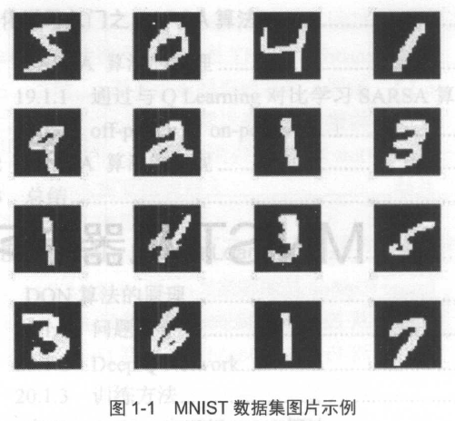
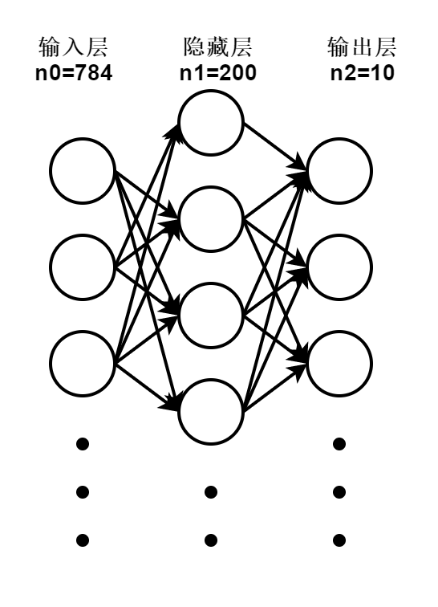
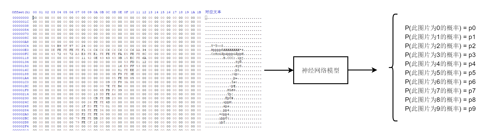
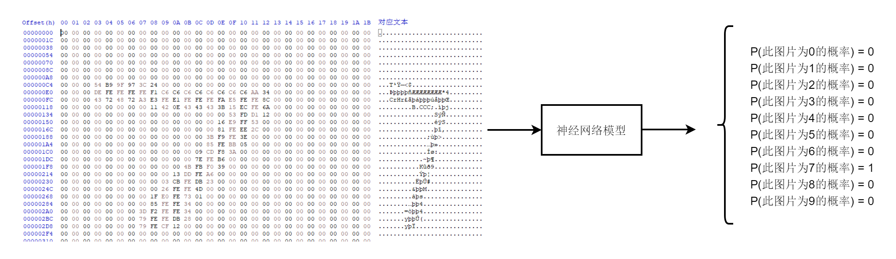

# 嵌入式AI -- 手写数字识别RISCV处理器C++纯底层实现(附带视频演示)

## 1 背景与前言

人类自产生以来，创造了辉煌的文明。例如、数学物理等惊人的理论成就，在这个过程中，阿拉伯数字起到了非常重要的作用。0 - 9 ，我们可以有各种各样的写法，不同的个体对每一个字符的写法都会根据他的书写特点而有所不同。相同个体的人，在自己不同的心情下写出来的数字形象很多时候也是截然不同。但是不变的是每一个数字字符，他的形状“大体很像”某个数字，让我们作为人类成功识别这些字符。


例如，下面的图片，同样是1，但是1的形象可能会稍有差别



那么计算机能否做到这样“模糊”的识别呢？输入一张包含模糊数字形象的图片，计算机帮我们判断出这个数字是多少，并打印出来？

这个问题就是“手写数字识别”的问题，使用python在x86架构的计算机上使用tensorflow之类的框架可以非常轻松的几行搞定。但是我出于学习的目的，以及我最初想在资源非常有限的MCU上运行AI代码的[理想](https://zhuanlan.zhihu.com/p/439472022),于是写了此篇文章，记录使用C++在以RISC-V为核心的嵌入式处理器[BL706](https://www.bouffalolab.com/)上运行手写数字识别的例子。


## 2 基本算法与数据集

基本算法采用经典的双层BP神经网络，结构如下



输入层维度选用28 * 28,对应是训练集每一张图片的像素大小，MINIST对应每一张图片的尺寸大小是28 * 28，因此输入层选用28 * 28 。

隐藏层神经元的个数选用200个，这个参数的大小是随意指定的，笔者试过，过多的隐藏层神经元并不会极大的提升准确率，并且会耗费非常更多的计算资源，这个参数会有一个最优选值。

输出层的维度选用十个神经元，因为需要预测图片为各个数字的概率，0-9对应十个数字，模型会给出这张图片对应为某个数字的概率。


**总体来说，需要做如下的事情**




输入一个28 * 28 bytes的图片数据，通过模型计算得到它为某个数字的概率，MCU找到对应判断输出概率最大的数值。

那么，我们的训练集应该是这样的



最好的情况是，当如输入训练集数据的时候，模型给出上图的结果。但是显然事实不应该是这样的，因为神经网络算法会模糊一些东西，增强联想的能力。所以最真实的情况是正确的数值概率非常接近于1，其他数值概率接近0。我们选取判断最大的数值为最终的输出结果。

**数据集合采用MINIST 免费数据集**

[MINIST](http://yann.lecun.com/exdb/mnist/)的数据包分为四个
分别为

train-labels-idx1-ubyte：训练集标签，每个标签为1个byte 包含60000个标签数据，前2个word包含文件信息，因此此文件大小为60000 + 8 Bytes。

train-images-idx3-ubyte：训练集图片数据，每个图片为28*28 bytes 包含60000个图片数据，前4个word包含文件信息，此文件大小为 60000 * 28 *28 + 16 Bytes。

t10k-labels-idx1-ubyte：训练集标签，每个标签为1个byte 包含10000个标签数据，前2个word包含文件信息，因此此文件大小为10000 + 8 Bytes。

t10k-images-idx3-ubyte：训练集图片数据，每个图片为28*28 bytes 包含10000个图片数据，前4个word包含文件信息，此文件大小为 10000 * 28 *28 + 16 Bytes。

了解其结构后，可以方便的使用C++预览数据集合。


## 3 C++实现

### 步骤1，导入训练集到特定的数据结构

``` C++
class label_data {
private:
    uint32_t fread_w(FILE *__restrict __stream)
    {
        uint32_t rlt = 0;
        uint8_t i = 0;
        int ch = 0;

        for (i = 0; i < 4; i++) {
            ch = fgetc(__stream);
            if (ch != EOF) {
                rlt <<= 8;
                rlt |= ch;
            }
        }
        return rlt;
    }

public:
    uint32_t magic_number;
    uint32_t items_number;

    uint8_t *label;

    label_data(const char *file_path)
    {
        FILE *fp = fopen(file_path, "r");
        uint32_t i = 0;

        magic_number = fread_w(fp);

        //printf("magic_number = 0x%x\r\n", magic_number);

        if (magic_number != 0x00000801) {
            printf("data set error\r\n");
            exit(0);
        }

        items_number = fread_w(fp);

        //printf("items_number = %d\r\n", items_number);

        label = new uint8_t[items_number];
        uint8_t tmp = 0;
        for (i = 0; i < items_number; i++) {
            tmp = fgetc(fp);
            label[i] = tmp;
        }
    }

    void display_label(uint16_t label_index)
    {
        uint8_t *label_fp = NULL;

        label_fp = label + label_index;

        printf("label[%d]=%d", label_index, *label_fp);
    }

    uint8_t *get_label(uint16_t label_index)
    {
        uint8_t *label_fp = NULL;

        label_fp = label + label_index;
        return label_fp;
    }
};

class image_data {
private:
    uint32_t fread_w(FILE *__restrict __stream)
    {
        uint32_t rlt = 0;
        uint8_t i = 0;
        int ch = 0;

        for (i = 0; i < 4; i++) {
            ch = fgetc(__stream);
            if (ch != EOF) {
                rlt <<= 8;
                rlt |= ch;
            }
        }
        return rlt;
    }

public:
    uint32_t magic_number;
    uint32_t image_number;
    uint32_t rows_number;
    uint32_t columns_number;

    uint8_t *image;

    image_data(const char *file_path)
    {
        FILE *fp = fopen(file_path, "r");
        uint32_t i = 0;

        magic_number = fread_w(fp);

        //printf("magic_number = 0x%x\r\n", magic_number);

        if (magic_number != 0x00000803) {
            printf("data set error\r\n");
            exit(0);
        }

        image_number = fread_w(fp);
        rows_number = fread_w(fp);
        columns_number = fread_w(fp);

        //printf("image size = %d\r\nrows_number = %d\r\ncolumns_number = %d\r\n", image_number, rows_number, columns_number);

        image = new uint8_t[image_number * rows_number * columns_number];
        uint8_t tmp = 0;
        for (i = 0; i < image_number * rows_number * columns_number; i++) {
            tmp = fgetc(fp);
            image[i] = tmp;
        }
    }

    void display_pic(uint16_t pic_index)
    {
        uint32_t i = 0, j = 0;
        uint8_t *image_fp = NULL;

        image_fp = image + pic_index * columns_number * rows_number;

        for (i = 0; i < rows_number; i++) {
            for (j = 0; j < columns_number; j++) {
                if (*(image_fp + i * columns_number + j) != 0) {
                    printf("0x%2x,", *(image_fp + i * columns_number + j));
                } else {
                    printf("     ");
                }
            }
            printf("\r\n");
        }
    }

    uint8_t *get_pic(uint16_t pic_index)
    {
        uint8_t *image_fp = NULL;

        image_fp = image + pic_index * columns_number * rows_number;

        return image_fp;
    }
};
```

上述代码创建了image与label的数据结构，用来妥善的把训练集数据与测试集数据用一个合理的数据结构包裹起来。

特地写了display函数，我们可以在控制台预览我们28*28的图片信息，查看它对应的标签数据。

``` C++
int main()
{
    image_data *train_image = new image_data("./train-images-idx3-ubyte");
    image_data *test_image = new image_data("./t10k-images-idx3-ubyte");

    label_data *train_label = new label_data("./train-labels-idx1-ubyte");
    label_data *test_label = new label_data("./t10k-labels-idx1-ubyte");

    train_image->display_pic(0);
    train_label->display_label(0);
}
```
输出的结果如下

```


                                                            0x 3,0x12,0x12,0x12,0x7e,0x88,0xaf,0x1a,0xa6,0xff,0xf7,0x7f,
                                        0x1e,0x24,0x5e,0x9a,0xaa,0xfd,0xfd,0xfd,0xfd,0xfd,0xe1,0xac,0xfd,0xf2,0xc3,0x40,
                                   0x31,0xee,0xfd,0xfd,0xfd,0xfd,0xfd,0xfd,0xfd,0xfd,0xfb,0x5d,0x52,0x52,0x38,0x27,
                                   0x12,0xdb,0xfd,0xfd,0xfd,0xfd,0xfd,0xc6,0xb6,0xf7,0xf1,
                                        0x50,0x9c,0x6b,0xfd,0xfd,0xcd,0x b,     0x2b,0x9a,
                                             0x e,0x 1,0x9a,0xfd,0x5a,
                                                       0x8b,0xfd,0xbe,0x 2,
                                                       0x b,0xbe,0xfd,0x46,
                                                            0x23,0xf1,0xe1,0xa0,0x6c,0x 1,
                                                                 0x51,0xf0,0xfd,0xfd,0x77,0x19,
                                                                      0x2d,0xba,0xfd,0xfd,0x96,0x1b,
                                                                           0x10,0x5d,0xfc,0xfd,0xbb,
                                                                                     0xf9,0xfd,0xf9,0x40,
                                                                      0x2e,0x82,0xb7,0xfd,0xfd,0xcf,0x 2,
                                                            0x27,0x94,0xe5,0xfd,0xfd,0xfd,0xfa,0xb6,
                                                  0x18,0x72,0xdd,0xfd,0xfd,0xfd,0xfd,0xc9,0x4e,
                                        0x17,0x42,0xd5,0xfd,0xfd,0xfd,0xfd,0xc6,0x51,0x 2,
                              0x12,0xab,0xdb,0xfd,0xfd,0xfd,0xfd,0xc3,0x50,0x 9,
                    0x37,0xac,0xe2,0xfd,0xfd,0xfd,0xfd,0xf4,0x85,0x b,
                    0x88,0xfd,0xfd,0xfd,0xd4,0x87,0x84,0x10,


label[0]=5
```

显然看到图片5的排布，以及其对应标签5，如此一来数据准备的工作就完成了。

### 步骤2，创建基于反向传播的训练算法，利用训练集进行训练
### 步骤3，用测试集查看模型准确性