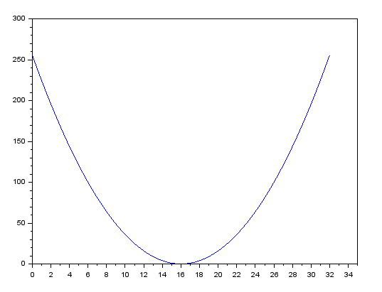

# Logistics regression 

# 二分类问题

## 极大似然估计

假设数据独立同分布且分布已知，利用已知的采样信息，反推最有可能导致此样本结果的模型参数。

一般来说，已知模型参数 $\Theta$ 求在此模型下 x 发生的概率
$$P=(x|\Theta)$$

但是如果反过来，通过一系列已经发生的事件x，反推模型参数$\Theta$就是极大似然估计问题。
$$P=(\Theta|x)$$

这个时候需要构建似然函数，他是一个关于$\Theta$ 变化的函数，要求得到一组$\Theta$，值使得在此$\Theta$模型下x发生的概率最大。


核心思想是通过计算，或者试参数的方法，确定一组最佳的$\Theta$，使得原先已经发生的事件同时发生的概率最大。

## 问题引入


假设已有数据集  
$$D =\{ (x^{(0)},y^{(0)}),(x^{(1)},y^{(1)}),..(x^{(n)},y^{(n)}) \} \ x \in R^n \: y \in \{0,1 \}$$

认为 $y^{(i)}$是标签，指明x点是落在边界函数上面部分还是下面部分。

我们的目的是确认一个预测函数

$$\hat{y}=f(x ,\Theta)$$

使得当我出现了一个新的不在训练集D中的x,预测函数估计出他是出现在边界函数上面部分的概率$$\hat{y}=P(y=1|x)$$

## 模型的建立过程如下

假设$$P(y = 1 | x) = p(x)$$$$P(y = 0 | x) =1-p(x)$$
假定的含义是，如果出现了一个新的点x随机分布在上述的图中，那么假定其落在正样本区域的概率为p(x)，落在负样本的概率为1-p(x)。

则在上述模型假设下 出现数据集合D的概率是
$$L(\hat{y},y) = \Pi(p(x)^{y^{(i)}} * (1-p(x))^{(1-y^{(i)})}) $$

为了求导方便两边通取ln

$$L(\hat{y},y) = \Sigma(y^{(i)}Inp(x) + (1-y^{(i)})In(1-p(x))) $$

$$ = \Sigma(y^{(i)}In\frac{p(x)}{1-p(x)} + In(1-p(x))) $$


我们希望 当出现数据集D中没有的新的x时，计算P(y = 1 |$x^i$)=p($x^i$)得到的概率尽可能的和已有训练集($x^i,y^i$)相等，也就是y与$\hat{y}$尽可能相等。

$p(x)$函数是将x与x出现在正样本区域概率之间建立联系的函数，这个函数里面包含着我们需要学习和优化的参数。根据概率模型，这个函数的值域是[0,1],我们又希望有线性成分，因此假设如下

$$\hat{y} = P(y=1|x)=\frac{1}{1+e^{-w^{T}x}}$$

这个是经典的sigmoid函数，值域满足要求。

将这个模型带入极大似然函数$L(\hat{y},y)$就得到了新的关于待估计参数w的函数 L(w,y,$\hat{y}$)。

$$ L(\hat{y},y^{(i)}) = \Sigma(y^{(i)}In\frac{p(x)}{1-p(x)} + In(1-p(x))) $$

$$ L(w)= \Sigma(y^{(i)} w^Tx^{(i)} - w^Tx^{(i)}-ln(1+e^{-{w^T}x^{(i)}}))$$

$$ = \Sigma((y^{(i)}-1)w^Tx^{(i)}-ln(1+e^{-{w^T}x^{(i)}}))$$

上述函数是把我们假设的p(x)模型带入极大似然估计函数得到的简化形式。

希望极大似然值越大越好，对应的损失函数越小越好

令 J(w) = -L(w)

最终问题化简为，通过确定参数w 使得 J(w)取到最小值。

$$J(w)= - \Sigma((y^{(i)}-1)w^Tx^{(i)}-ln(1+e^{-{w^T}x^{(i)}}))$$

根据梯度下降法，得到

$$w^{k+1}: w=w^k - aJ'(w)$$
a为更新步长,J'(w)为J(w)对w的一阶导数

针对此模型 具体的算法是

$$J'(w)= - \Sigma((y^{(i)}-1)x^{(i)}+\frac{e^{-{w^T}x^{(i)}}}{1+e^{-{w^T}x^{(i)}}}*x^{(i)})$$

$$= \Sigma((\frac{1}{1+e^{-w^{T}x}}-y^{(i)})*x^{(i)})$$

# 利用计算图回顾求导过程确定具体算法

## 简化问题如下
假定数据X的维度是2，X={X1,X2}，则问题变为 需要确定一个线性边界(关于w1 w2 b三个参数的线性方程) $$y=w1x1+w2x2+b$$

使得数据集合D在此模型上的损失最小。

## 正向计算过程

$$z=w1*x1+w2*x2+b $$$$\downarrow$$$$\hat{y}=a=\sigma(z)$$$$\downarrow$$$$L(a,y)=-(yln(a)+(1-y)ln(1-a))$$

目的是找一个最佳的{w1,w2,b}参数集合，使得损失函数L(a,y)最小。

## 随机梯度下降法证明与使用
简化问题如下：
假定我给如了初始参数w0,那么此参数如何变化使得损失函数J(w,y)会变小。

根据泰勒公式$$J(w)= J(w0)+(w-w0)J'(w) + o$$
当w0与w相近的时候 o趋向于0。

令$$w=w0 + \lambda * d$$
($\lambda$为步长是标量，d是单位向量,目标是确定单位向量的方向，哪一个方向d会使得J(w)下降最快)

代入公式

$$J(w0 + \lambda d) = J(w0) + \lambda dJ'(w)$$

当我们确定了一个w0参数的时候，J(w0)也随之确定，因此J(w0)是一个不变的常量。我们的目标是$J(w0 + \lambda d)$ 要尽可能的小，而且一定要比 J(w0)小。

$$J(w0+ \lambda d) - J(w0) = \lambda d J'(w0)< 0$$

步长$\lambda$一般为正数，所以不等式变为

$$d J'(w0) < 0$$

其中J'(w0)是损失函数J(w)在w0点的梯度,是向量。d表示下一步前进的单位向量。

向量积的算法如下
$$A * B = |A| * |B| * cos \theta$$

当$\theta = 2\pi$也就是 向量A 与向量B 完全反向的时候 A * B的值最小$cos(2\pi)=-1$。

因此当 d 与 J'(w0)方向相反的时候，两向量乘积最小(乘积是负数，并且模最大)

我们定义d是单位向量，因此如果希望最快，令

$$d=- \frac{J'(w0)}{|J'(w0)|}$$

将这个最快的方向d，代入回原式子得到

$$w = w0 - \lambda * \frac{J'(w0)}{|J'(w0)|}$$

显然 梯度下降的理论只是证明了“方向”，梯度的负方向是J(w)下降的方向，但是具体的步长还是需要$\lambda$来决定。

## 随机梯度下降法在一维下的图形意义

假设损失函数 $$J(w) = {(w - 16)}^2  \ \ \ w \in [0,32]$$ 



## 使用梯度下降法来求此函数的最小值

并且 $$J'(w) = 2(w-16)$$

J'(w)是实际意义是图像的斜率，看到在[0,16]区间上J'(w)小于0，在[16,32]区间上J'(w)大于0，
从图像意义上来看，如果初始值在0，那么我们希望w是 0 -> 1 -> 2 向右移动的，这样可以找到最小值。如果初始值在31的位置，显然希望向左移动。从符号来看J'(w)符合最聪明的运动策略。

根据梯度下降法
假设步长为 1
$\lambda=1$
$w0=0$
$w = w0 - 2(w0-16)$

|  w   | J(w)  | J'(w)|
|  --   | --   | ---  | 
| 0  | 256 | -32|
| 32  | 256 | 32|
| 0  | 256 | -32|
| 32  | 256 | 32|
....

梯度下降法似乎没有正常工作，在不停的循环往复，试着把步长降低。

$\lambda=0.1$
$w0=0$
$w = w0 - 0.2(w0-16)$

|  w   | J(w)    | J'(w)|
|  --   | --     | ---  | 
| 0     | 256    | -3.2 |
| 3.2   | 163.84 | -2.56|
| 5.76  | 104.85 | -2.048  |
| 7.808 | 67.10    |   -1.638 |
| 9.446   | 42.9 | -1.3108|
| 10.756  | 27 | -1.0488  |
| 11.804 | 17   |   -0.8392 |
...

以此类推，认为最终一定会到达图示最小值位置，当w=16的时候J(w)=0，对于简单函数可以用解析的方法来求解，但是复杂函数就不能。使用梯度下降法，只要迭代的次数够多，就可以无限精确地接近极小值。

## 随机梯度下降法使用C语言实现

```C
void grad_des(float w0, float lambda, int n) {
  /* fix J(w)= (x-16)^2 */
  /* fix J'(w) = 2 * (x-16) */
  /* w = w0 - lambda * J'(w) run for n time*/

  float w = 0;
  int i = 0;
  for (i = 0; i < n; i++) {

    w = w0 - lambda * 2 * (w0 - 16.0);
    w0 = w;

    printf("n=%d,w=%f,lambda=%f,J(w)=%f,J'(w)=%f\r\n", i, w, lambda,
           (w - 16.0) * (w - 16.0), 2.0 * (w - 16.0));
  }
}
```

输入w0=0 lambda=1 迭代次数为10的结果

    n=0,w=32.000000,lambda=1.000000,J(w)=256.000000,J'(w)=32.000000
    n=1,w=0.000000,lambda=1.000000,J(w)=256.000000,J'(w)=-32.000000
    n=2,w=32.000000,lambda=1.000000,J(w)=256.000000,J'(w)=32.000000
    n=3,w=0.000000,lambda=1.000000,J(w)=256.000000,J'(w)=-32.000000
    n=4,w=32.000000,lambda=1.000000,J(w)=256.000000,J'(w)=32.000000
    n=5,w=0.000000,lambda=1.000000,J(w)=256.000000,J'(w)=-32.000000
    n=6,w=32.000000,lambda=1.000000,J(w)=256.000000,J'(w)=32.000000
    n=7,w=0.000000,lambda=1.000000,J(w)=256.000000,J'(w)=-32.000000
    n=8,w=32.000000,lambda=1.000000,J(w)=256.000000,J'(w)=32.000000
    n=9,w=0.000000,lambda=1.000000,J(w)=256.000000,J'(w)=-32.000000

输入w0=0 lambda=0.1 迭代次数为10的结果

    n=0,w=3.200000,lambda=0.100000,J(w)=163.839999,J'(w)=-25.600000
    n=1,w=5.760000,lambda=0.100000,J(w)=104.857595,J'(w)=-20.480000
    n=2,w=7.808000,lambda=0.100000,J(w)=67.108863,J'(w)=-16.384000
    n=3,w=9.446400,lambda=0.100000,J(w)=42.949677,J'(w)=-13.107201
    n=4,w=10.757120,lambda=0.100000,J(w)=27.487789,J'(w)=-10.485760
    n=5,w=11.805696,lambda=0.100000,J(w)=17.592182,J'(w)=-8.388607
    n=6,w=12.644557,lambda=0.100000,J(w)=11.258998,J'(w)=-6.710886
    n=7,w=13.315645,lambda=0.100000,J(w)=7.205761,J'(w)=-5.368710
    n=8,w=13.852516,lambda=0.100000,J(w)=4.611687,J'(w)=-4.294968
    n=9,w=14.282013,lambda=0.100000,J(w)=2.951480,J'(w)=-3.435974

看到迭代次数不够多，多来几次 n =50 

    n=0,w=3.200000,lambda=0.100000,J(w)=163.839999,J'(w)=-25.600000
    n=1,w=5.760000,lambda=0.100000,J(w)=104.857595,J'(w)=-20.480000
    n=2,w=7.808000,lambda=0.100000,J(w)=67.108863,J'(w)=-16.384000
    n=3,w=9.446400,lambda=0.100000,J(w)=42.949677,J'(w)=-13.107201
    n=4,w=10.757120,lambda=0.100000,J(w)=27.487789,J'(w)=-10.485760
    n=5,w=11.805696,lambda=0.100000,J(w)=17.592182,J'(w)=-8.388607
    n=6,w=12.644557,lambda=0.100000,J(w)=11.258998,J'(w)=-6.710886
    n=7,w=13.315645,lambda=0.100000,J(w)=7.205761,J'(w)=-5.368710
    n=8,w=13.852516,lambda=0.100000,J(w)=4.611687,J'(w)=-4.294968
    n=9,w=14.282013,lambda=0.100000,J(w)=2.951480,J'(w)=-3.435974
    n=10,w=14.625610,lambda=0.100000,J(w)=1.888947,J'(w)=-2.748779
    n=11,w=14.900488,lambda=0.100000,J(w)=1.208927,J'(w)=-2.199024
    n=12,w=15.120390,lambda=0.100000,J(w)=0.773714,J'(w)=-1.759220
    n=13,w=15.296312,lambda=0.100000,J(w)=0.495176,J'(w)=-1.407375
    n=14,w=15.437050,lambda=0.100000,J(w)=0.316913,J'(w)=-1.125900
    n=15,w=15.549640,lambda=0.100000,J(w)=0.202824,J'(w)=-0.900721
    n=16,w=15.639711,lambda=0.100000,J(w)=0.129808,J'(w)=-0.720577
    n=17,w=15.711769,lambda=0.100000,J(w)=0.083077,J'(w)=-0.576462
    n=18,w=15.769415,lambda=0.100000,J(w)=0.053169,J'(w)=-0.461170
    n=19,w=15.815532,lambda=0.100000,J(w)=0.034029,J'(w)=-0.368937
    n=20,w=15.852426,lambda=0.100000,J(w)=0.021778,J'(w)=-0.295149
    n=21,w=15.881941,lambda=0.100000,J(w)=0.013938,J'(w)=-0.236118
    n=22,w=15.905553,lambda=0.100000,J(w)=0.008920,J'(w)=-0.188894
    n=23,w=15.924442,lambda=0.100000,J(w)=0.005709,J'(w)=-0.151115
    n=24,w=15.939554,lambda=0.100000,J(w)=0.003654,J'(w)=-0.120892
    n=25,w=15.951643,lambda=0.100000,J(w)=0.002338,J'(w)=-0.096714
    n=26,w=15.961314,lambda=0.100000,J(w)=0.001497,J'(w)=-0.077372
    n=27,w=15.969051,lambda=0.100000,J(w)=0.000958,J'(w)=-0.061897
    n=28,w=15.975241,lambda=0.100000,J(w)=0.000613,J'(w)=-0.049519
    n=29,w=15.980192,lambda=0.100000,J(w)=0.000392,J'(w)=-0.039616
    n=30,w=15.984154,lambda=0.100000,J(w)=0.000251,J'(w)=-0.031693
    n=31,w=15.987323,lambda=0.100000,J(w)=0.000161,J'(w)=-0.025354
    n=32,w=15.989859,lambda=0.100000,J(w)=0.000103,J'(w)=-0.020283
    n=33,w=15.991887,lambda=0.100000,J(w)=0.000066,J'(w)=-0.016226
    n=34,w=15.993509,lambda=0.100000,J(w)=0.000042,J'(w)=-0.012981
    n=35,w=15.994807,lambda=0.100000,J(w)=0.000027,J'(w)=-0.010386
    n=36,w=15.995846,lambda=0.100000,J(w)=0.000017,J'(w)=-0.008308
    n=37,w=15.996676,lambda=0.100000,J(w)=0.000011,J'(w)=-0.006647
    n=38,w=15.997341,lambda=0.100000,J(w)=0.000007,J'(w)=-0.005318
    n=39,w=15.997873,lambda=0.100000,J(w)=0.000005,J'(w)=-0.004253
    n=40,w=15.998299,lambda=0.100000,J(w)=0.000003,J'(w)=-0.003403
    n=41,w=15.998639,lambda=0.100000,J(w)=0.000002,J'(w)=-0.002722
    n=42,w=15.998911,lambda=0.100000,J(w)=0.000001,J'(w)=-0.002178
    n=43,w=15.999128,lambda=0.100000,J(w)=0.000001,J'(w)=-0.001743
    n=44,w=15.999303,lambda=0.100000,J(w)=0.000000,J'(w)=-0.001394
    n=45,w=15.999442,lambda=0.100000,J(w)=0.000000,J'(w)=-0.001116
    n=46,w=15.999554,lambda=0.100000,J(w)=0.000000,J'(w)=-0.000893
    n=47,w=15.999643,lambda=0.100000,J(w)=0.000000,J'(w)=-0.000713
    n=48,w=15.999715,lambda=0.100000,J(w)=0.000000,J'(w)=-0.000570
    n=49,w=15.999772,lambda=0.100000,J(w)=0.000000,J'(w)=-0.000456

看到的确随着迭代次数的增加结果越来越接近最小值。