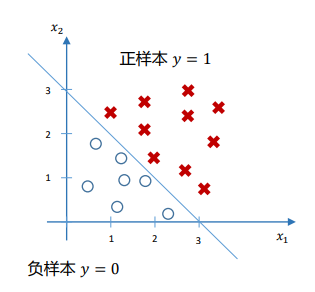

# Logistics regression 

# 二分类问题

## 极大似然估计

假设数据独立同分布且分布已知，利用已知的采样信息，反推最有可能导致此样本结果的模型参数。

一般来说，已知模型参数 $\Theta$ 求在此模型下 x 发生的概率
$$P=(x|\Theta)$$

但是如果反过来，通过一系列已经发生的事件x，反推模型参数$\Theta$就是极大似然估计问题。
$$P=(\Theta|x)$$

这个时候需要构建似然函数，他是一个关于$\Theta$ 变化的函数，要求得到一组$\Theta$，值使得在此$\Theta$模型下x发生的概率最大。

核心思想是通过计算，或者试参数的方法，确定一组最佳的$\Theta$，使得原先已经发生的事件同时发生的概率最大。

## 问题引入

假设已有数据集  
$$D =\{ (x^{(0)},y^{(0)}),(x^{(1)},y^{(1)}),..(x^{(n)},y^{(n)}) \} \ x \in R^n \: y \in \{0,1 \}$$

认为 $y^{(i)}$是标签，指明x点是落在边界函数上面部分还是下面部分。

我们的目的是确认一个预测函数

$$\hat{y}=f(x ,\Theta)$$

使得当我出现了一个新的不在训练集D中的x,预测函数估计出他对应的分类$\hat{y}$。

## $f(x)$模型的建立过程如下

假设$$P(y = 1 | x) = p(x)$$$$P(y = 0 | x) =1-p(x)$$
假定的含义是，如果出现了一个新的点x随机分布在上述的图中，那么假定其落在正样本区域的概率为p(x)，落在负样本的概率为1-p(x)。

则在上述模型假设下 出现数据集合D的概率是
$$L(\hat{y},y) = \Pi(p(x)^{y^{(i)}} * (1-p(x))^{(1-y^{(i)})}) $$

为了求导方便两边通取ln

$$L(\hat{y},y) = \Sigma(y^{(i)}Inp(x) + (1-y^{(i)})In(1-p(x))) $$

$$ = \Sigma(y^{(i)}In\frac{p(x)}{1-p(x)} + In(1-p(x))) $$

我们希望 当出现数据集D中没有的新的x时，计算P(y = 1 |$x^i$)=p($x^i$)得到的概率尽可能的和已有训练集($x^i,y^i$)相等，也就是y与$\hat{y}$尽可能相等。

$p(x)$函数是将x与x出现在正样本区域概率之间建立联系的函数，这个函数里面包含着我们需要学习和优化的参数。根据概率模型，这个函数的值域是[0,1],我们又希望有线性成分，因此假设如下

$$\hat{y} = P(y=1|x)=\frac{1}{1+e^{-w^{T}x}}$$

这个是经典的sigmoid函数，值域满足要求。

将这个模型带入极大似然函数$L(\hat{y},y)$就得到了新的关于待估计参数w的函数 L(w,y,$\hat{y}$)。

$$ L(\hat{y},y^{(i)}) = \Sigma(y^{(i)}In\frac{p(x)}{1-p(x)} + In(1-p(x))) $$

$$ L(w)= \Sigma(y^{(i)} w^Tx^{(i)} - w^Tx^{(i)}-ln(1+e^{-{w^T}x^{(i)}}))$$

$$ = \Sigma((y^{(i)}-1)w^Tx^{(i)}-ln(1+e^{-{w^T}x^{(i)}}))$$

上述函数是把我们假设的p(x)模型带入极大似然估计函数得到的简化形式。

希望极大似然值越大越好，对应的损失函数越小越好

令 J(w) = -L(w)

最终问题化简为，通过确定参数w 使得 J(w)取到最小值。

$$J(w)= - \Sigma((y^{(i)}-1)w^Tx^{(i)}-ln(1+e^{-{w^T}x^{(i)}}))$$

根据梯度下降法，得到

$$w^{k+1}: w=w^k - aJ'(w)$$
a为更新步长,J'(w)为J(w)对w的一阶导数

针对此模型 具体的算法是

$$J'(w)= - \Sigma((y^{(i)}-1)x^{(i)}+\frac{e^{-{w^T}x^{(i)}}}{1+e^{-{w^T}x^{(i)}}}*x^{(i)})$$

$$= \Sigma((\frac{1}{1+e^{-w^{T}x}}-y^{(i)})*x^{(i)})$$

# 证明梯度下降法