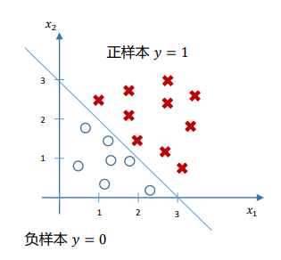

# 嵌入式AI -- Logistics Regression问题

## 前言

无论是身处在温暖的家中，惬意的呼喊“天猫精灵”、“小爱同学”，还是在街边摊点拿着兼并油条准备付钱时的刷脸支付，机器学习已经俨然成为了我们生活中不可或缺的一部分。绝大多数机器学习的方法，都是以框架+高级脚本语言的形式使用的，这些框架和高级脚本语言需要非常昂贵的运行环境，一台装有linux或者windows操作系统的台式机，或者类似树莓派这样的小型计算机，很多时候需要联网。运行流行的机器学习算法在运行着linux的x86处理器架构似乎不是一件难事，选择tensorflow或者potych框架，然后根据框架服务商提供的Tutorial可以很快的部署起非常酷炫的AI应用，例如人形识别之类。

然而在众多应用场景，例如在网络条件很差的环境，设备不能将传感器数据发送到远端AI服务器，或者场景不允许昂贵的设备条件。在这些应用场景下，固有的流行框架+高级脚本语言方案就不能满足要求。

这些应用场合的最佳的计算机设备就是MCU，我会把它称之为嵌入式设备，他的特点是小巧，低功耗，低成本，但是相应的ram和rom资源较少，网络环境配置难度也比普通平台大。

笔者了解到大厂在将他们固有的框架慢慢移植进MCU领域，例如[tensorflow Lite](https://tensorflow.google.cn/lite/microcontrollers/overview)，但是笔者发现这个代码依旧非常臃肿，看不出嵌入式应有的简洁，框架就是简化版的tensorflow，有很多遗留问题。

笔者有一个理想，希望首先将一些经典的机器学习方法，使用C/C++来实现一遍，例如神经网络。笔者通过网络环境学习到了一些经典的机器学习理论，希望这些算法能以轻量的方式运行在各种不同平台的MCU中，使用C/C++语言的优点是可移植性很强，可以在任意平台编译运行，不需要部署任何框架环境，只需要安装好对应处理器架构的gcc Toolchain。

我在github托管了一个名为TinyAi的开源项目，记录我这个理想的实现过程，希望和大家能有所交流。

https://github.com/JingyanChen/TinyAi

这个项目的初衷是自己学习使用，最终的目标是将这些算法运行在各大MCU平台上。

这个系列《嵌入式AI--xxx》文章是开源项目的其中一部分，所有源码都可以在仓库中找到。

# Logistics Regression
## 从提出问题开始

假设在x1,x2两个维度确定的平面里，有m个小球，红色小球(叉叉形状)以及蓝色小球（圈圈形状）。是否可以画出一条线，将红球和黑球区分开来。

换一种提法，当出现了一个新的球(颜色未知)，随机扔出去(落在平面内会确定一个坐标(x1,x2)),那么请问他是红球的概率是多少？

这些提法用数学的表达就是

假设已有数据集  
$$D =\{ (x^{(0)},y^{(0)}),(x^{(1)},y^{(1)}),..(x^{(m)},y^{(m)}) \} \ x \in R^n \: y^{(i)} \in \{0,1 \}$$

$x^{(i)}$是n维度样本数据，在此问题中是二维的维度也就是$x^{(i)}={({x}^{(i)}_1,{x}^{(i)}_2)}$，$y^{(i)}$是标签,在此问题中是1或者0，如果样本的$y^{(i)}$是1可以理解为是红球/点落在边界上方，如果样本的$y^{(i)}$是0可以理解为是蓝球/点落在边界下方。

**我们的目的是确认一个预测函数**

$$\hat{y}=f(x ,w)$$

使得当我出现了一个新的小球落在(x1,x2)上,预测其是红色/落在边界上方的概率
$$\hat{y}=P(y=1|x) = f(x ,w)$$
x是新的球的坐标，w是模型参数，$\hat{y}$是新球是红球的概率，f是预测函数，暂时还没有确定。

## 建立模型的过程

根据上述的目标，我们有两个任务要做

1.确定预测函数f的基本结构
2.确定预测函数f里的参数具体的最优值

首先，先做第一个任务，确认预测函数f的基本结构。

我们用一个线性变换，将概率$\hat{y}$与二维数据x=(x1,x2)联系起来。

$$z = w1 * x1 + w2 * x2 + b$$

这里用三个参数(w1,w2,b)来联系了预测概率z与二维数据x=(x1,x2)之间的关系。

但是出现一个显然的问题，概率是一个[0,1]数值，如果不在这个区间，那么就很难使用概率的思想。

因此需要对z进行一个sigmoid变换。

$$\sigma(z) =\frac{1}{1+e^{-w^{T}z}}$$

使用sigmoid函数之后，可以把任意值域的函数转化为[0,1]范围，他的优点很多，暂时先不提，至少帮助我们把$$z = w1 * x1 + w2 * x2 + b$$中的 $z$ 通过 
$$a = \sigma(z)$$
转化为 $a$,$a\in(0,1)$。

那么，我们就选择这个函数作为我们的预测函数

$$\hat{y}=P(y=1|x) = \sigma(w1 * x1 + w2 * x2 + b)$$

至此，我们的任务一完成了，找到了一个预测函数的基本结构。

接下来，我们思考的重点变为了如何确定这个预测函数的参数 w1,w2,b，哪一组参数是最佳的模型参数？

### 极大似然估计的思想

一般来说，当我们已知概率模型的参数 $\Theta$ 然后我们把事件x输入概率函数，就可以计算出事件x发生的概率,这个时概率计算问题。$$P(x|\Theta)$$

但是，当我们通过已知的样本，反推其模型参数$\Theta$时，这个就是极大似然估计的问题。
$$P(\Theta|x)$$

我个人的总结如下，极大似然估计的思想关键在于，你固定了一组模型参数$\Theta$从而确定了一个概率函数来预测未发生的事件概率，那么如何评判你的这个$\Theta$参数配置的好不好？我们不能拿未知的事情来评判，只能从已经发生的事件来验证，而验证的方法简而言之就是“预测出来的所有事件同时发生的概率最大”，越大说明模型参数越好。

从本章最初的例子来说，假定我已经拥有了一些“事实”数据集合 
$$D =\{(0,0,1),(1,2,0),(3,5,1)\}$$ 

其中括号里的数据意义时(x1,x2,y),(x1,x2)组成了小球所在的坐标,y为1代表为红球，0代表为黑球。

那么，假设我建立了一个概率预测函数,预测出来一个新的坐标为(xx1,xx2)的小球，他为红球的概率。
$$P(y=1|x)$$

那么，我们先不谈预测未知的事件，我们肯定希望已经发生的事情经过你的预测函数与事实结果一致！

我们希望事件 {坐标为(0,0)的球是红球} {坐标为(1,2)的球是蓝球} {坐标为(3,5)的球是红球} 这三个事件带入我们的预测函数，同时发生的概率最大。因为这三个事件同时发生是我们样本的事实，所以这个是我们评判参数是否合理的重要依据。

也就是

$$L=P({坐标为(0,0)的球是红球})P({坐标为(1,2)的球是红球})P({坐标为(3,5)的球是红球})$$
L越大，说明预测函数 $P(x|\Theta)$越好。

### 回到问题本身

我们之前确定了一个预测函数，这个函数基本的结构我们确定好了，但是部分参数还需要确认。

$$p(x) = P(y=1|x) = \sigma(w1 * x1 + w2 * x2 + b) $$

我们根据极大似然估计的思想，我们拥有m个样本点，他们包含了球的坐标$x^{(i)}=({x^{(i)}}_0,{x^{(i)}}_1)$,同时也包含了这些样本点事实的颜色输出结果 $y^{(i)}=\{0 \ or \ 1\}$

那么我们建立一个极大似然估计函数

$$L = \Pi(p(x)^{y^{(i)}} * (1-p(x))^{(1-y^{(i)})}) $$

L是所有样本同时发生的概率，是每个独立事件的连乘。

假设第一个样本输出结果是1时，$$L=p(x) * ... $$

当第二个样本输出结果是 0 时,

$$L=p(x) * (1-p(x)) * ...$$

以此类推。

读者可以自行思考下L函数是否是所有样本事件同时发生的联合概率。

为后续求导方便，我们会对式子两边同时做ln操作，将连乘转化为连加

$$L = \Sigma(y^{(i)}Inp(x) + (1-y^{(i)})In(1-p(x))) $$

$$ = \Sigma(y^{(i)}In\frac{p(x)}{1-p(x)} + In(1-p(x))) $$

那么根据上一节的理论，我们希望L越大越好，越大说明参数选择越好。但是在机器学习中我们更喜欢谈论越小越好的问题，所以干脆定义一个损失函数J。

$$J=-L$$

这样，我们定义了损失函数J，就可以把问题变化为，如何选择合适的(w1,w2,b)模型参数，使得损失函数J最小。

## 如何获得最佳参数使得损失函数最小

目前我们完成了任务1，确认好了预测函数的基本结构$\hat{y}=\sigma(x1*w1+x2*w2+b)$
并且我们知道了评判模型参数(w1,w2,b)好坏的依据是损失函数J尽可能的小。

那么确定最佳参数的问题变为了求极值的问题。我们一般会使用梯度下降法来求解此问题。

针对目前待解决的问题，梯度下降法的结论是，

当(w1,w2,b)的变化方向如下所示的时候 

$$w1 = w1 - \frac{\partial J}{\partial w1} $$

$$w2 = w2 - \frac{\partial J}{\partial w2} $$

$$b = b - \frac{\partial J}{\partial b} $$

损失函数J会越来越小。理论证明会在后续文章出给出，这篇文章大可先确认这个结论。

于是我们找到了确定(w1,w2,b)参数的方法
$$0:给定初始值w1=0,w2=0,b=0$$ $$\downarrow$$ $$1:z=w1 * x1 + w2 * x2 + b$$$$\downarrow$$$$2:\hat{y}=a=\sigma(z)$$$$\downarrow$$$$3:计算损失函数 L = \Sigma(y^{(i)}Inp(x) + (1-y^{(i)})In(1-p(x))) $$$$\downarrow$$$$4:根据梯度下降法更新w1,w2,b三个参数$$$$\downarrow$$$$回到步骤1，循环迭代直到迭代结束$$

## C实现与结果